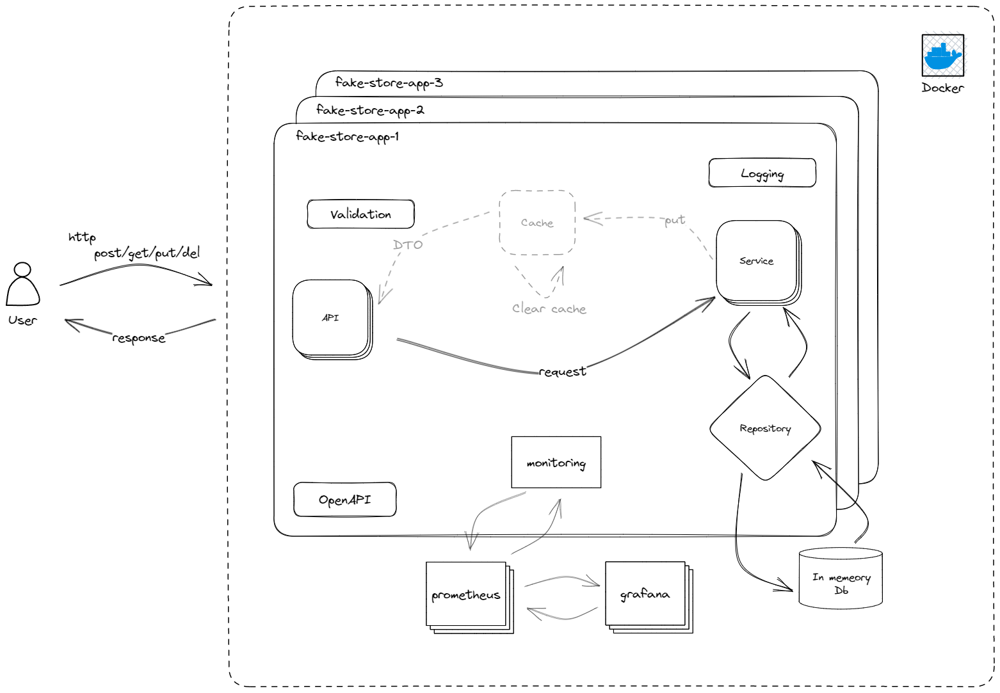

# Fake Store App

---

### Description

This is a fake store app with spring boot.

### Architecture



### Technologies

- Java 17
- Spring Boot 3.0
- Open API Documentation
- Spring Data JPA
- Spring AOP
- Kotlin
- H2 In Memory Database
- Maven
- Docker
- Docker Compose
- Prometheus
- Grafana

## Docker Run

The application can be built and run by the `Docker` engine. The `Dockerfile` has multistage build, so you do not need
to build and run separately.

Please follow the below directions in order to build and run the application with Docker Compose;

```sh
$ cd open-weather
$ docker-compose up -d
```

Docker compose creates 3 replicas (instances) of the application on port range 9595-9597

**You can reach the open-api-ui via**  `http://{HOST}:{9595-9597}/swagger-ui.html`

### Grafana

**You can reach grafana page via** `http://{HOST}:3000` - _GF_SECURITY_ADMIN_PASSWORD=admin_

---

## Maven Run

To build and run the application with `Maven`, please follow the directions below;

```sh
$ cd fake-store-app
$ mvn clean install
$ mvn spring-boot:run
```

You can reach the swagger-ui via  `http://{HOST}:8080/swagger-ui.html`

---